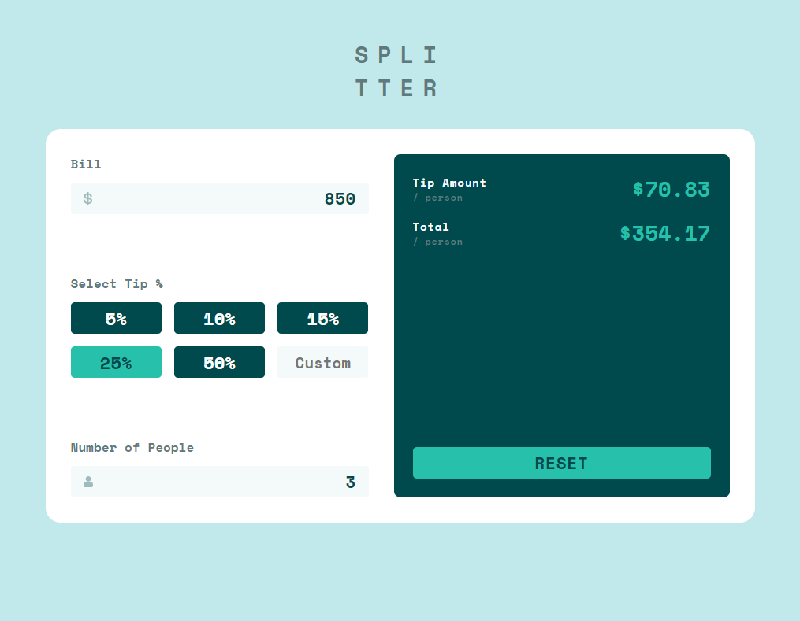
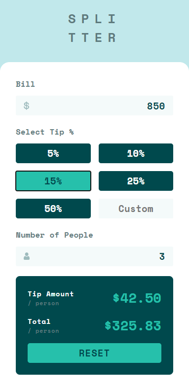

# tip-calculator-app-main

A Tip Calculator from Frontend Mentor

# Technologies
In this project I used HTML, SCSS(SASS), JS.

[This is a challenge of FrontEnd Mentor](https://www.frontendmentor.io/challenges/sunnyside-agency-landing-page-7yVs3B6ef).

## Result

> ### See the result live [here](https://tip-calculator-app-main-lusk1nha.vercel.app/)

Desktop -

Mobile -

